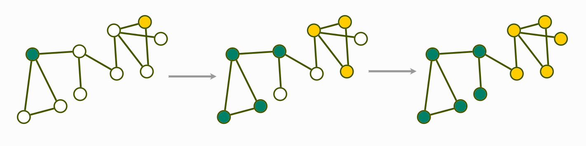

# Computer Science and Engineering Master's Degree Thesis

**Title**: Clustering Graphs
**Subtitle**: Applying a Label Propagation Algorithm to Detect Communities in Graph Databases

The thesis is on the detection of collaboration communities in the academia by making use of graph databases such as Neo4j or ArangoDB and a Label Propagation Community Detection Algorithm. To visualize the results, a full webapp was build made of a frontend interface with React, TypeScript and CytoscapeJS consuming a custom built GraphQL API with NodeJS and Express.

### The thesis

**Pdf file of the thesis**: [2021-09-14_masters_thesis_document.pdf](./masters_thesis/2021-09-14_masters_thesis_document.pdf)

**LaTeX source code of the thesis**: [./masters_thesis](https://github.com/formidablae/Masters_Thesis/tree/main/masters_thesis)

### The presentation

**Presentation slides (only)**: [2021-09-23_thesis_presentation_slides_only](./thesis_presentation/2021-09-23_thesis_presentation_slides_only)

**Presentation slides (with notes)**: [2021-09-23_thesis_presentation_slides_and_notes.pdf](./thesis_presentation/2021-09-23_thesis_presentation_slides_and_notes.pdf)

**Presentation slides (with notes x4 per page)**: [2021-09-23_thesis_presentation_slides_and_notes_x4_per_A4_page.pdf](./thesis_presentation/2021-09-23_thesis_presentation_slides_and_notes_x4_per_A4_page.pdf)

**LaTeX source code of the presentation slides**: [./thesis_presentation](https://github.com/formidablae/Masters_Thesis/tree/main/thesis_presentation)

### Project's Source Code

**Preliminary data conversion (XML to JSON)**: [./convert_large_xml_to_json](https://github.com/formidablae/Masters_Thesis/tree/main/convert_large_xml_to_json)

**Dataset import in ArangoDB**: [./arangodb_import_json_data](https://github.com/formidablae/Masters_Thesis/tree/main/arangodb_import_json_data)

**Data manipulations towards obtaining the graph**: [./distribute_data_in_arangodb](https://github.com/formidablae/Masters_Thesis/tree/main/distribute_data_in_arangodb)

**Source code of the GraphQL API back-end**: [./adomainthat-rocks_backend](https://github.com/formidablae/Masters_Thesis/tree/main/adomainthat-rocks_backend)

**Source code of the front-end interface**: [./adomainthat-rocks_frontend](https://github.com/formidablae/Masters_Thesis/tree/main/adomainthat-rocks_frontend)

### An overview

##### The dataset

##### Data conversion, import and transformations

##### A sample graph of researchers and their publications, other entities

##### The Label Propagation Community Detection Algorithm used to detect communities

##### The results of the detection of communities

##### Visualization of the results with a full-stack webapp

###### The front-end interface made with React, TypeScript and CytoscapeJS

in detail

in production

zoomed in graph of collaborations

**Note**: This thesis was awarded with the Rovelli Award as the best graduation thesis of Computer Science and Engineering Degree of 2021 related to topics of software development. Prize was awarded by the [University of Bergamo](https://en.unibg.it/) and [WebResults](https://www.webresults.it/en/).
